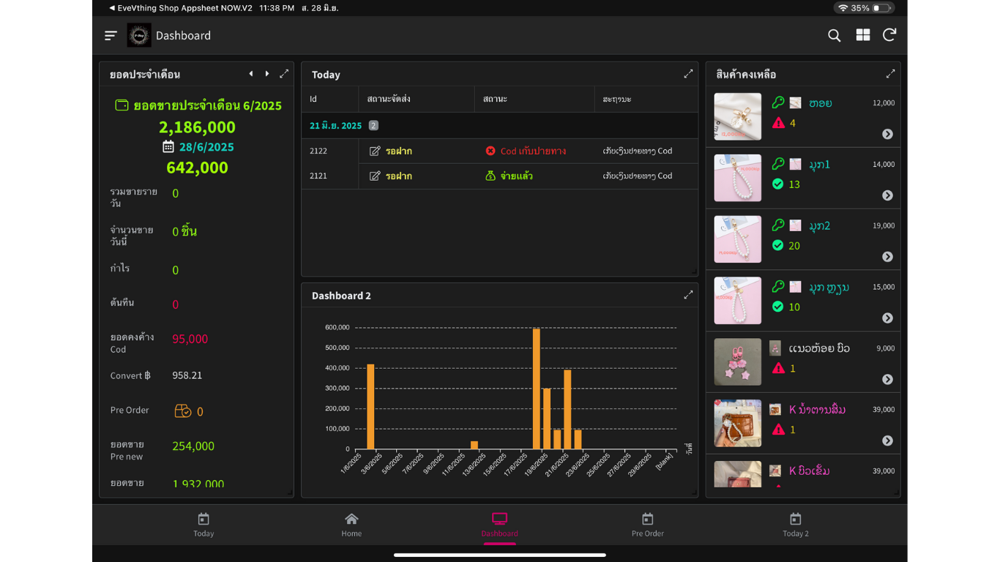
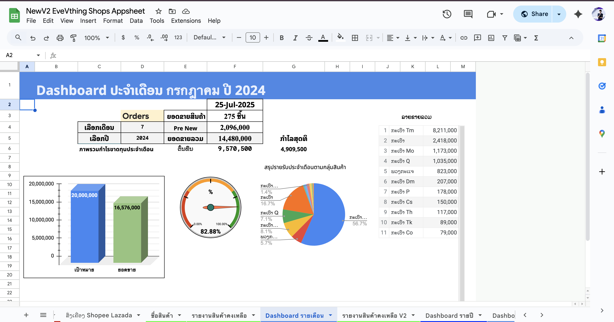
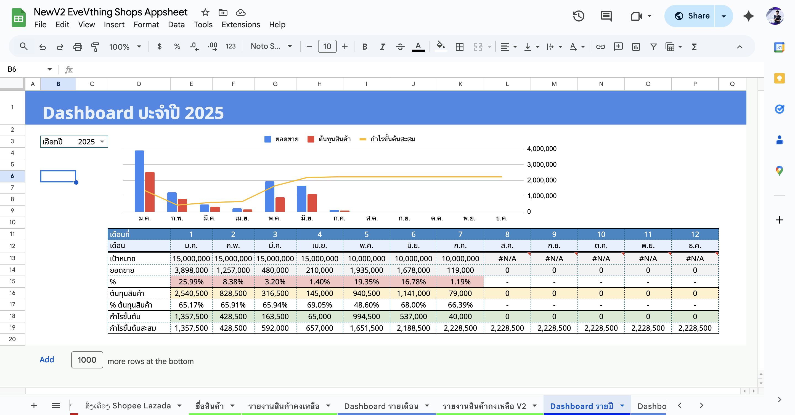

# 🛍️ Online Store Management System

A complete **Online Store Management System** built using **AppSheet**, **Google Sheets**, **Telegram**, and **Google Apps Script**. Designed to help manage finances, stock, COD status, and monthly reporting — all accessible on mobile.

---

## 🖼️ App Screenshot

> _Place your screenshot in the `/images` folder and name it `store-app-demo.png`._

---

## ✅ Key Features

- 💰 **Money Management**
  - Track income, expenses, and net profit
  - View daily/weekly/monthly summaries
  - Integrated with Google Sheets for real-time updates

- 📦 **Stock Management**
  - View real-time stock quantity
  - Add or update stock with barcode or name
  - Notify when stock is low (optional)

- 📮 **COD Status**
  - Track Cash on Delivery (COD) status by customer
  - View pending / delivered / canceled orders

- 📊 **Monthly Report**
  - Auto-generated reports for sales, profit, stock, and more
  - Visualized with charts and summaries

- 📢 **Telegram Notification**
  - Send order alerts or stock updates to Telegram groups
  - Apps Script integration with Telegram Bot API

- 🖼️ **Image Support**
  - Upload product images or receipts
  - Display images directly inside the app

- 👥 **Multi-user Roles**
  - Admin: Full access (money, stock, reports)
  - Staff: Add/update stock and orders
  - Viewer: Read-only reports

---

## 📁 App Pages Overview

| Page Name            | Description                                              |
|----------------------|----------------------------------------------------------|
| **Dashboard**         | Summary of income, orders, and notifications            |
| **Money Tracker**     | View & manage cash flow (income/expenses)               |
| **Stock**             | Product inventory with quantity and image               |
| **Orders (COD)**      | Order list with customer name, amount, and COD status   |
| **Monthly Report**    | Charts + summary by month (sales, expenses, balance)    |
| **Telegram Settings** | Link to Telegram Bot for notifications                  |
| **Product Images**    | Upload and view product or receipt images               |
| **User Access**       | Manage user roles and permissions                       |

---

